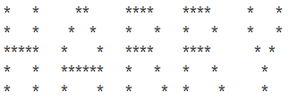
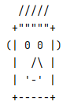
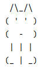

## Opgaver lektion 1

Inden du går i gang med nedenstående opgaver, skal du have installeret og opsat IntelliJ og
Java JDK 21, hvis du ikke allerede har gjort dette.

Løs følgende opgaver sammen med din skuldermakker. Gå først videre til næste opgave, når
begge har løst den aktuelle opgave.

### Opgave 1
Du skal her ikke køre nedenstående programmer men tænke dig til svaret.

a) Hvad udskriver programmet Test1

    public class Test1 {
        public static void main(String[] args) {
            System.out.println("42 + 4");
            System.out.println(42 + 4);
        }
    }

b) Hvad udskriver programmet Test2
    
    public class Test2 {
        public static void main(String[] args) {
            System.out.print("Hello");
            System.out.println("World");
        }
    }

c) Hvad er compile fejlen i programmet Test3

    public class Test3 {
        public static void main(String[] args) {
            System.out.println("Hello", "World");
        }
    }

---

### Opgave 2

I denne opgave skal du følge noten Installation og opsætning af IntelliJ, side 8.

I pakken opgave02 skal du oprette en klasse med navnet HelloWorld. 

Lav en main metode,
som udskriver Hello, World!

Få programmet til at udskrive en velkomst indeholdende dit eget navn.

### Opgave 3

Lav i pakken opgave03 et program der udskriver summen af de første ti positive heltal, 1 + 2+ … +10.

### Opgave 4

Lav i pakken opgave04 et program der udskriver dit navn i store bogstaver som:

### Opgave 5

Lav i pakken opgave05 et program der udskriver et ansigt i stil med nedenstående:

### Opgave 5

Lav i pakken opgave06 et program der udskriver en tegning i stil med nedenstående:

### Opgave 6 *

*Dette er opgave 1.7 fra undervisningsbogen.*

$\pi$ kan aproximeres med formlen 

$\pi = 4 * (1 - \frac{1}{3} + \frac{1}{5} - \frac{1}{7} + \frac{1}{9} - \frac{1}{11} ...)$

Lav et program der udskriver resultatet af denne formel med henholdsvis 5 og 6 led. 

$\pi = 4 * (1 - \frac{1}{3} + \frac{1}{5} - \frac{1}{7} + \frac{1}{9} - \frac{1}{11})$

$\pi = 4 * (1 - \frac{1}{3} + \frac{1}{5} - \frac{1}{7} + \frac{1}{9} - \frac{1}{11} + \frac{1}{13})$

Brug 1.0 i stedet for 1, hvor 1 forekommer i formlen. 

### Opgave 7 *

*Dette er opgave 1.8 fra undervisningsbogen.* 

(Areal og omkreds af en cirkel.)
Lav et program der udskriver arealet og omkredsen af en cirkel med radius 6.5, brug følgende formler

$areal = 2 * radius * \pi$

$omkreds = radius^2 * \pi$

Til $\pi$ kan du bruge konstanten 

    Math.PI

### Opgave 8*

*Dette er opgave 1.10 fra bogen*

(Gennemsnitshastighed i miles)
En løber løber 15 kilometer på 50 minutter og 30 sekunder.

Lav et program der beregner gennemsnitshastigheden i miles per time.

1 mile er 1,6 kilometer
